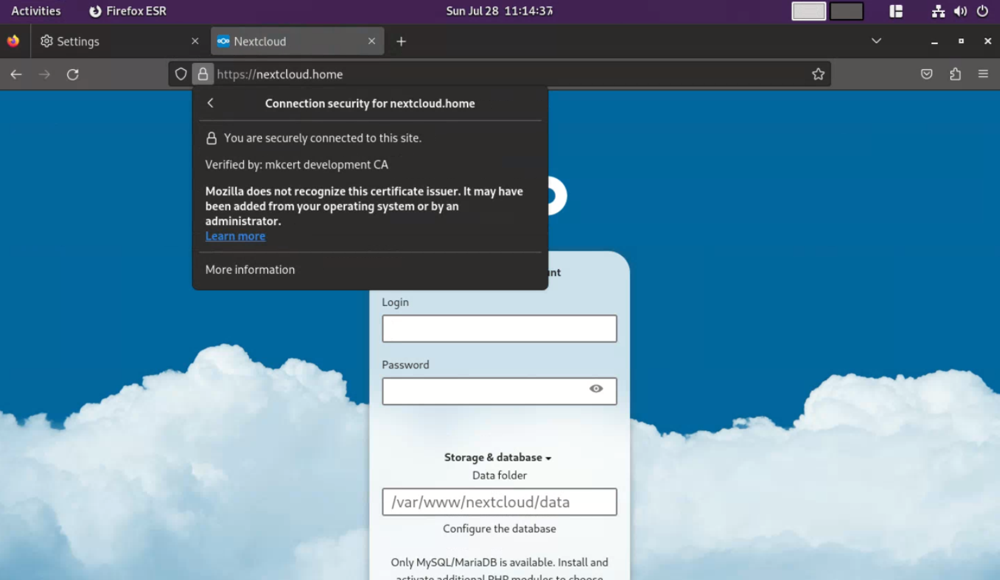
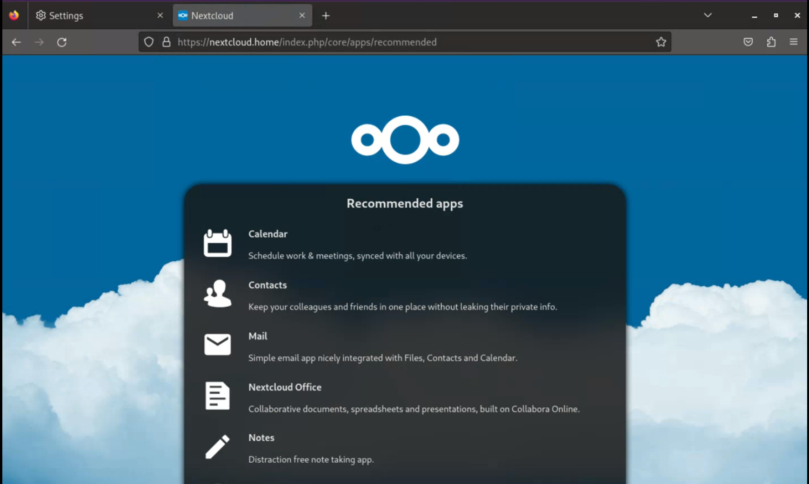

# Automated-Nextcloud-Installation-Script-with-Local-SSL

Nextcloud with Local SSL Using mkcert

## Client Setup

<video width="100%" height="100%" controls>
  <source src="https://www.youtube.com/watch?v=VPrBt8KuAi0" type="video/mp4">
</video>

## Server Installation Process

<video width="100%" height="100%" controls>
  <source src="https://www.youtube.com/watch?v=zl4xx7vaaAw" type="video/mp4">
</video>
